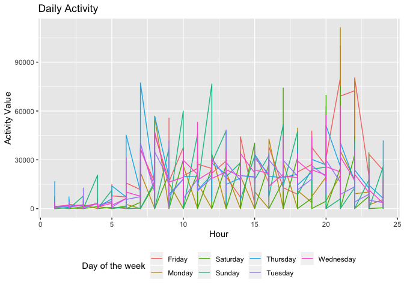

hw3
================
Lizbeth Gomez
10/10/2019

``` r
library(tidyverse)
```

    ## ── Attaching packages ────────────────────────────────────────────────────────────── tidyverse 1.2.1 ──

    ## ✔ ggplot2 3.2.1     ✔ purrr   0.3.2
    ## ✔ tibble  2.1.3     ✔ dplyr   0.8.3
    ## ✔ tidyr   1.0.0     ✔ stringr 1.4.0
    ## ✔ readr   1.3.1     ✔ forcats 0.4.0

    ## ── Conflicts ───────────────────────────────────────────────────────────────── tidyverse_conflicts() ──
    ## ✖ dplyr::filter() masks stats::filter()
    ## ✖ dplyr::lag()    masks stats::lag()

``` r
library(p8105.datasets)
data("instacart")

#1: Description:
nrow(instacart)
```

    ## [1] 1384617

``` r
ncol(instacart)
```

    ## [1] 15

``` r
#2:How many aisles are there, and which aisles are the most items ordered from?

instacart%>%
  count(aisle)
```

    ## # A tibble: 134 x 2
    ##    aisle                      n
    ##    <chr>                  <int>
    ##  1 air fresheners candles  1067
    ##  2 asian foods             7007
    ##  3 baby accessories         306
    ##  4 baby bath body care      328
    ##  5 baby food formula      13198
    ##  6 bakery desserts         1501
    ##  7 baking ingredients     13088
    ##  8 baking supplies decor   1094
    ##  9 beauty                   287
    ## 10 beers coolers           1839
    ## # … with 124 more rows

``` r
instacart %>%
  count(aisle, name = "aisle_count") %>% 
  arrange(desc(aisle_count))
```

    ## # A tibble: 134 x 2
    ##    aisle                         aisle_count
    ##    <chr>                               <int>
    ##  1 fresh vegetables                   150609
    ##  2 fresh fruits                       150473
    ##  3 packaged vegetables fruits          78493
    ##  4 yogurt                              55240
    ##  5 packaged cheese                     41699
    ##  6 water seltzer sparkling water       36617
    ##  7 milk                                32644
    ##  8 chips pretzels                      31269
    ##  9 soy lactosefree                     26240
    ## 10 bread                               23635
    ## # … with 124 more rows

``` r
#3: Make a plot that shows the number of items ordered in each aisle, limiting this to aisles with more than 10000 items ordered. Arrange aisles sensibly, and organize your plot so others can read it.

instacart %>%
  count(aisle, name = "items_count") %>% 
  arrange(desc (items_count)) %>% 
  filter(items_count > 10000) %>% 
ggplot(aes(x = items_count, y = aisle)) + 
  geom_point()
```

<!-- -->

``` r
#4: Make a table showing the three most popular items in each of the aisles “baking ingredients”, “dog food care”, and “packaged vegetables fruits”. Include the number of times each item is ordered in your table.


instacart %>% 
  filter(aisle %in% c( "dog food care", "baking ingredients", "packaged vegetables fruits")) %>% 
  count(aisle, product_name) %>% 
  group_by(aisle) %>% 
  top_n(3) %>% 
  knitr::kable()
```

    ## Selecting by n

| aisle                      | product\_name                                 |    n |
| :------------------------- | :-------------------------------------------- | ---: |
| baking ingredients         | Cane Sugar                                    |  336 |
| baking ingredients         | Light Brown Sugar                             |  499 |
| baking ingredients         | Pure Baking Soda                              |  387 |
| dog food care              | Organix Chicken & Brown Rice Recipe           |   28 |
| dog food care              | Small Dog Biscuits                            |   26 |
| dog food care              | Snack Sticks Chicken & Rice Recipe Dog Treats |   30 |
| packaged vegetables fruits | Organic Baby Spinach                          | 9784 |
| packaged vegetables fruits | Organic Blueberries                           | 4966 |
| packaged vegetables fruits | Organic Raspberries                           | 5546 |

``` r
#5:Make a table showing the mean hour of the day at which Pink Lady Apples and Coffee Ice Cream are ordered on each day of the week; format this table for human readers (i.e. produce a 2 x 7 table)

instacart %>% 
  filter(product_name %in% c( "Pink Lady Apples", " Coffee Ice Cream")) %>% 
  group_by(order_dow) %>% 
  summarise(average_order_hour = mean(order_hour_of_day)) %>% 
  mutate(order_dow = recode(order_dow, `1` = 'Mon', `2` = 'Tues', `3` = 'Wed', `4` = 'Thur', `5` = 'Fri', `6` = 'Sat', `0` = 'Sun'))%>% 
  knitr::kable()
```

| order\_dow | average\_order\_hour |
| :--------- | -------------------: |
| Sun        |             13.44118 |
| Mon        |             11.36000 |
| Tues       |             11.70213 |
| Wed        |             14.25000 |
| Thur       |             11.55172 |
| Fri        |             12.78431 |
| Sat        |             11.93750 |

\#\#Dataset description: \#The dataset contains 1,384,617 observations
of 15 variables, where each row in the dataset is a product from an
order. There is a single order per user in this dataset, which means
that every single row is an item purchased at one point by the user at a
given time. This dataset contains variables describing the time of day
of item purchase( “order\_hour\_of\_the\_day”), the online order
identifier for the user (“order\_id”), whether this user had purchased
the item at a previous time (“reordered”), etc. Illustrative
<example:For> instance unser number 34, purchased organic whole milk,
bananas, marinara pasta sauce, low fat yogurt and half and half. one
thing is for sure, they’re not allergic to dairy.

\#Answers: \#1: There are 134 aisles in this dataset* \#2: Most products
are purchased from the fresh fruit aisle and the packaged vegetable
fruits aisle* \#3: see plot above* \#4: See table above* \#5: See table
above\*

``` r
 data("brfss_smart2010")

#Data cleaning
brfss_smart2010 = 
  brfss_smart2010%>%
  janitor::clean_names() %>% 
  rename( state = locationabbr,county = locationdesc)%>%
  filter(topic == "Overall Health") %>% 
  filter(response %in% c("Excellent", "Very good", "Good", "Fair", "Poor")) %>% 
  mutate(response =fct_reorder(response, display_order))

head(brfss_smart2010)
```

    ## # A tibble: 6 x 23
    ##    year state county class topic question response sample_size data_value
    ##   <int> <chr> <chr>  <chr> <chr> <chr>    <fct>          <int>      <dbl>
    ## 1  2010 AL    AL - … Heal… Over… How is … Excelle…          94       18.9
    ## 2  2010 AL    AL - … Heal… Over… How is … Very go…         148       30  
    ## 3  2010 AL    AL - … Heal… Over… How is … Good             208       33.1
    ## 4  2010 AL    AL - … Heal… Over… How is … Fair             107       12.5
    ## 5  2010 AL    AL - … Heal… Over… How is … Poor              45        5.5
    ## 6  2010 AL    AL - … Heal… Over… How is … Excelle…          91       15.6
    ## # … with 14 more variables: confidence_limit_low <dbl>,
    ## #   confidence_limit_high <dbl>, display_order <int>,
    ## #   data_value_unit <chr>, data_value_type <chr>,
    ## #   data_value_footnote_symbol <chr>, data_value_footnote <chr>,
    ## #   data_source <chr>, class_id <chr>, topic_id <chr>, location_id <chr>,
    ## #   question_id <chr>, respid <chr>, geo_location <chr>

``` r
#In 2002, which states were observed at 7 or more locations? What about in 2010?

brfss_smart2010%>%
  filter(year ==2002) %>% 
  separate(county, into = c("state", "county"), sep = " - ") %>% 
  distinct(state, county) %>% 
  count(state) %>% 
  filter(n >= 7)
```

    ## # A tibble: 6 x 2
    ##   state     n
    ##   <chr> <int>
    ## 1 CT        7
    ## 2 FL        7
    ## 3 MA        8
    ## 4 NC        7
    ## 5 NJ        8
    ## 6 PA       10

``` r
brfss_smart2010%>%
  filter(year ==2010) %>% 
  separate(county, into = c("state", "county"), sep = " - ") %>% 
  distinct(state, county) %>% 
  count(state) %>% 
  filter(n >= 7)  
```

    ## # A tibble: 14 x 2
    ##    state     n
    ##    <chr> <int>
    ##  1 CA       12
    ##  2 CO        7
    ##  3 FL       41
    ##  4 MA        9
    ##  5 MD       12
    ##  6 NC       12
    ##  7 NE       10
    ##  8 NJ       19
    ##  9 NY        9
    ## 10 OH        8
    ## 11 PA        7
    ## 12 SC        7
    ## 13 TX       16
    ## 14 WA       10

``` r
#Construct a dataset that is limited to Excellent responses, and contains, year, state, and a variable that averages the data_value across locations within a state. 

excellent_data = 
  brfss_smart2010%>%
  filter(response %in% c("Excellent")) %>% 
  select(response, year, state, data_value) %>% 
  group_by(state) %>% 
  mutate (mean_data_value = mean(data_value))

#Make a “spaghetti” plot of this average value over time within a state (that is, make a plot showing a line for each state across years – the geom_line geometry and group aesthetic will help).
excellent_data%>%
  group_by (state) %>% 
ggplot(aes(x = year, y = mean_data_value, color = state)) +
  geom_point() +
  geom_line() + 
  labs (
    title = "Mean Data Values Over the Years",
        x = "Year",
        y = "Mean data values"
  )
```

    ## Warning: Removed 398 rows containing missing values (geom_point).

    ## Warning: Removed 398 rows containing missing values (geom_path).

<!-- -->

``` r
#Make a two-panel plot showing, for the years 2006, and 2010, distribution of data_value for responses (“Poor” to “Excellent”) among locations in NY State
 ny_data =
    brfss_smart2010 %>%
    filter(state == "NY", year == "2006" | year == "2010") %>%
    arrange(year) 
 
 ny_data%>% 
   group_by(county) %>% 
   ggplot(aes(group = county, x = response, y = data_value, color = county)) + 
   geom_line() +
   facet_grid (~year) +
   labs(title = "Health Responses in New York for 2006 and 2010 by County", 
       x = "Health Response",
       y = "Data Value of Health Response") +
   scale_color_hue(name = "County in NY") +
   theme(legend.position = "bottom")
```

<!-- -->

\#\#Answers: \#1: in 2006 there were 6 states with seven or more
locations observed, while in 2010 there were 14 \#2: see spaghetti plot
above \#3: see plot
above

``` r
#This problem uses five weeks of accelerometer data collected on a 63 year-old male with BMI 25, who was admitted to the Advanced Cardiac Care Center of Columbia University Medical Center and diagnosed with congestive heart failure (CHF).

#Load, tidy, and otherwise wrangle the data. Your final dataset should include all originally observed variables and values; have useful variable names; include a weekday vs weekend variable; and encode data with reasonable variable classes. Describe the resulting dataset (e.g. what variables exist, how many observations, etc).

accel = 
  read.csv("./data/accel_data.csv") %>%
  janitor::clean_names() %>% 
  rename(day_number = day_id, day_of_the_week = day) %>% 
  rename_at(vars(starts_with("activity")), funs(str_replace(., "activity", "minute"))) %>% 
  mutate(weekday= 
           if_else (day_of_the_week == "Monday", "weekday",
           if_else (day_of_the_week == "Tuesday", "weekday", 
           if_else (day_of_the_week == "Wednesday", "weekday",
           if_else (day_of_the_week == "Thursday","weekday",  
           if_else (day_of_the_week == "Friday","weekday",
           if_else (day_of_the_week == "Saturday","weekend",
           if_else (day_of_the_week == "Sunday","weekend", NA_character_))))))))
```

    ## Warning: funs() is soft deprecated as of dplyr 0.8.0
    ## Please use a list of either functions or lambdas: 
    ## 
    ##   # Simple named list: 
    ##   list(mean = mean, median = median)
    ## 
    ##   # Auto named with `tibble::lst()`: 
    ##   tibble::lst(mean, median)
    ## 
    ##   # Using lambdas
    ##   list(~ mean(., trim = .2), ~ median(., na.rm = TRUE))
    ## This warning is displayed once per session.

``` r
#Using your tidied dataset, aggregate accross minutes to create a total activity variable for each day, and create a table showing these totals. Are any trends apparent?
accel_total = accel %>% 
  mutate(
    total_activity = select(., minute_1:minute_1440) %>% 
      rowSums(na.rm = TRUE) %>% 
      round(digits = 2) 
  ) 

accel_total = accel_total%>% 
  select(weekday, day_of_the_week, total_activity) %>%  
  group_by(day_of_the_week) %>% 
  summarise(average_order_hour = mean(total_activity))
  knitr::kable(accel_total)
```

| day\_of\_the\_week | average\_order\_hour |
| :----------------- | -------------------: |
| Friday             |             458342.1 |
| Monday             |             371739.8 |
| Saturday           |             273847.4 |
| Sunday             |             383842.6 |
| Thursday           |             418230.1 |
| Tuesday            |             359847.6 |
| Wednesday          |             425954.4 |

``` r
head(accel_total)
```

    ## # A tibble: 6 x 2
    ##   day_of_the_week average_order_hour
    ##   <fct>                        <dbl>
    ## 1 Friday                     458342.
    ## 2 Monday                     371740.
    ## 3 Saturday                   273847.
    ## 4 Sunday                     383843.
    ## 5 Thursday                   418230.
    ## 6 Tuesday                    359848.

``` r
# Make a single-panel plot that shows the 24-hour activity time courses for each day and use color to indicate day of the week. Describe in words any patterns or conclusions you can make based on this graph


accel_plot = accel %>% 
  mutate(
    "1" = select(., minute_1:minute_60) %>% 
      rowSums(na.rm = TRUE),
    "2" = select(., minute_61:minute_120) %>% 
      rowSums(na.rm = TRUE),
    "3" = select(., minute_121:minute_180) %>% 
      rowSums(na.rm = TRUE),
    "4" = select(., minute_181:minute_240) %>% 
      rowSums(na.rm = TRUE),
    "5" = select(., minute_241:minute_300) %>% 
      rowSums(na.rm = TRUE),
    "6" = select(., minute_301:minute_360) %>% 
      rowSums(na.rm = TRUE),
    "7" = select(., minute_361:minute_420) %>% 
      rowSums(na.rm = TRUE),
    "8" = select(., minute_421:minute_480) %>% 
      rowSums(na.rm = TRUE),
    "9" = select(., minute_481:minute_540) %>% 
      rowSums(na.rm = TRUE),
    "10" = select(., minute_541:minute_600) %>% 
      rowSums(na.rm = TRUE),
    "11" = select(., minute_601:minute_660) %>% 
      rowSums(na.rm = TRUE),
    "12" = select(., minute_661:minute_720) %>% 
      rowSums(na.rm = TRUE),
    "13" = select(., minute_721:minute_780) %>% 
      rowSums(na.rm = TRUE),
    "14" = select(., minute_781:minute_840) %>% 
      rowSums(na.rm = TRUE),
    "15" = select(., minute_841:minute_900) %>% 
      rowSums(na.rm = TRUE),
    "16" = select(., minute_901:minute_960) %>% 
      rowSums(na.rm = TRUE),
    "17" = select(., minute_961:minute_1020) %>% 
      rowSums(na.rm = TRUE),
    "18" = select(., minute_1021:minute_1080) %>% 
      rowSums(na.rm = TRUE),
    "19" = select(., minute_1081:minute_1140) %>% 
      rowSums(na.rm = TRUE),
    "20" = select(., minute_1141:minute_1200) %>% 
      rowSums(na.rm = TRUE),
    "21" = select(., minute_1201:minute_1260) %>% 
      rowSums(na.rm = TRUE),
    "22" = select(., minute_1261:minute_1320) %>% 
      rowSums(na.rm = TRUE),
    "23" = select(., minute_1321:minute_1380) %>% 
      rowSums(na.rm = TRUE),
    "24" = select(., minute_1381:minute_1440) %>% 
      rowSums(na.rm = TRUE)
  )
accel_plot = accel_plot%>% 
  subset(select = c(1, 3, 1445:1468)) %>% 
  arrange(week,day_of_the_week) 

accel_plot = accel_plot%>% 
  pivot_longer(
    3:26,
    names_to = "hour",
    values_to = "activity"
  )  %>% 
  mutate(
    hour= as.numeric(hour) #change to numeric
  )

accel_plot %>% 
  group_by(week, day_of_the_week)%>%
  ggplot(aes(grup = day_of_the_week, x= hour, y = activity)) + 
  geom_line( aes(color = day_of_the_week)) +
  labs(title = "Daily Activity", 
       x = "Hour",
       y = "Activity Value") +
   scale_color_hue(name = "Day of the week") +
   theme(legend.position = "bottom")
```

<!-- -->

\#Description \#\# This dataset contains 35 observations with 1444
variables. This data represents almost four years of the patient’s daily
activity, down to each minute of a 24 hour day for 35 days. \#\#
stratifying by day of the week shows that weekends are generaly lower in
terms of activity for the patient. \#\# from the graph we can see that
this patient is most active during weekdays; the data also shows that as
expected there is minimal activity duing early hours of the day,
presumably this is when the patient is sleeping or resting.
